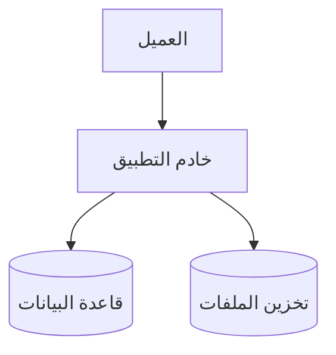

# هيكلية النظام

## مخطط بنية النظام

## مكوّنات النظام
- **العميل**: واجهات الويب والموبايل التي يتفاعل معها المستخدمون.
- **خادم التطبيق**: واجهة REST Express التي تطبق منطق العمل وتفرض الضوابط الأمنية.
- **قاعدة البيانات**: SQLite/SQLCipher لحفظ بيانات الموارد والموظفين.
- **خدمات المراقبة والتنبيه**: تجمع المقاييس وتسجل الأحداث للأمان والأداء.
- **خدمة الهوية**: تدعم بروتوكولات OAuth2/OpenID Connect للمصادقة الموحدة.

## تدفّق المصادقة
1. يرسل المستخدم بيانات الاعتماد إلى خادم التطبيق عبر اتصال TLS.
2. يتحقق الخادم من هوية المستخدم ويولّد رمز جلسة أو JSON Web Token.
3. تُخزَّن الجلسة في مخزن آمن وتُعاد للمستخدم كملف تعريف ارتباط آمن.
4. يستخدم العميل الرمز للوصول إلى نقاط النهاية المحمية، ويتم التحقق من الصلاحيات في كل طلب.

## أماكن تخزين الأسرار
- تُدار المفاتيح وكلمات المرور عبر متغيرات البيئة المحمّلة من مدير أسرار خارجي.
- تُخزَّن مفاتيح التشفير داخل ملف `security-config.json` مشفّر ومحصور الوصول.
- أسرار النشر تحفظ في مستودع مخصص مع تشفير على القرص وإمكانية تدقيق.

## حدود الثقة
- المتصفح أو تطبيق الموبايل خارج حدود الثقة، ويُعامل كعميل غير موثوق.
- خادم التطبيق ضمن نطاق موثوق ويتواصل مع قاعدة البيانات عبر شبكة داخلية آمنة.
- أي خدمات طرف ثالث أو تكاملات خارجية تعامل كنطاقات منخفضة الثقة ويتم عزلها.

## معدل الطلبات
- يفرض النظام حدًا افتراضيًا يبلغ **60 طلبًا لكل 15 دقيقة** لكل عنوان IP.
- يمكن لكل مستخدم مصدَّق إرسال ما يصل إلى **120 طلبًا لكل 15 دقيقة**.
- اكتشاف الاندفاعات السريعة يتم من خلال نافذة قصيرة (دقيقة واحدة) بحد أقصى 20 طلبًا.
