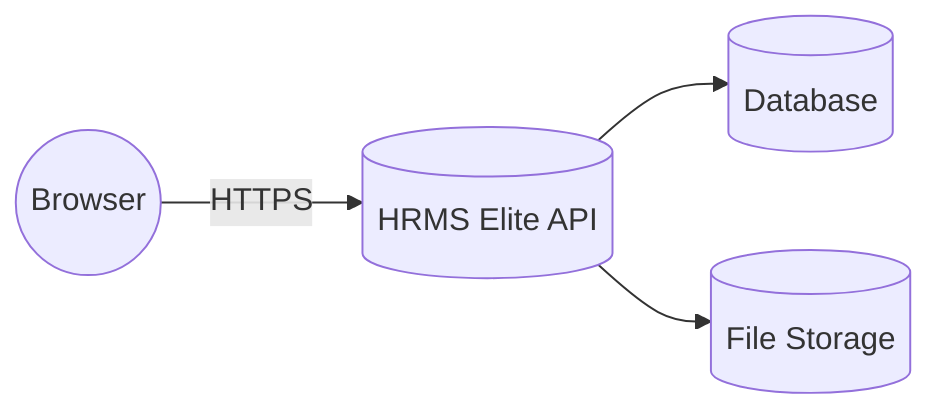
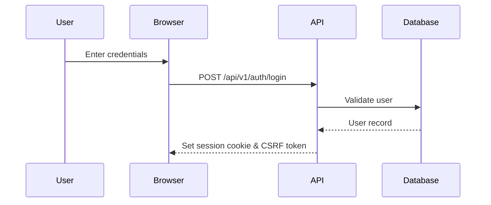
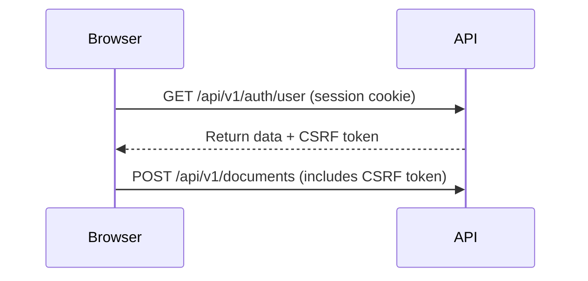
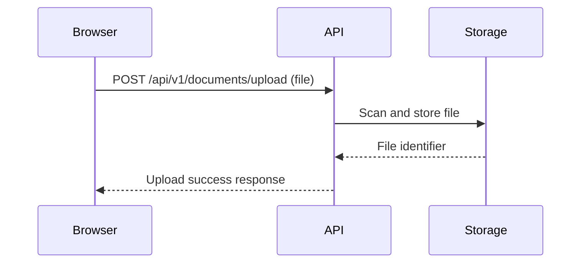

# HRMS Elite Architecture

## High-Level Overview

```mermaid
graph LR
  Client((Browser)) -->|HTTPS| API[(HRMS Elite API)]
  API --> DB[(Database)]
  API --> Storage[(File Storage)]
```

## Authentication Flow

```mermaid
sequenceDiagram
  participant U as User
  participant B as Browser
  participant A as API
  participant DB as Database
  U->>B: Enter credentials
  B->>A: POST /api/v1/auth/login
  A->>DB: Validate user
  DB-->>A: User record
  A-->>B: Set session cookie & CSRF token
```

## CSRF Protection Flow

```mermaid
sequenceDiagram
  participant B as Browser
  participant A as API
  B->>A: GET /api/v1/auth/user (session cookie)
  A-->>B: Return data + CSRF token
  B->>A: POST /api/v1/documents (includes CSRF token)
```

## File Upload Flow

```mermaid
sequenceDiagram
  participant B as Browser
  participant A as API
  participant S as Storage
  B->>A: POST /api/v1/documents/upload (file)
  A->>S: Scan and store file
  S-->>A: File identifier
  A-->>B: Upload success response
```
