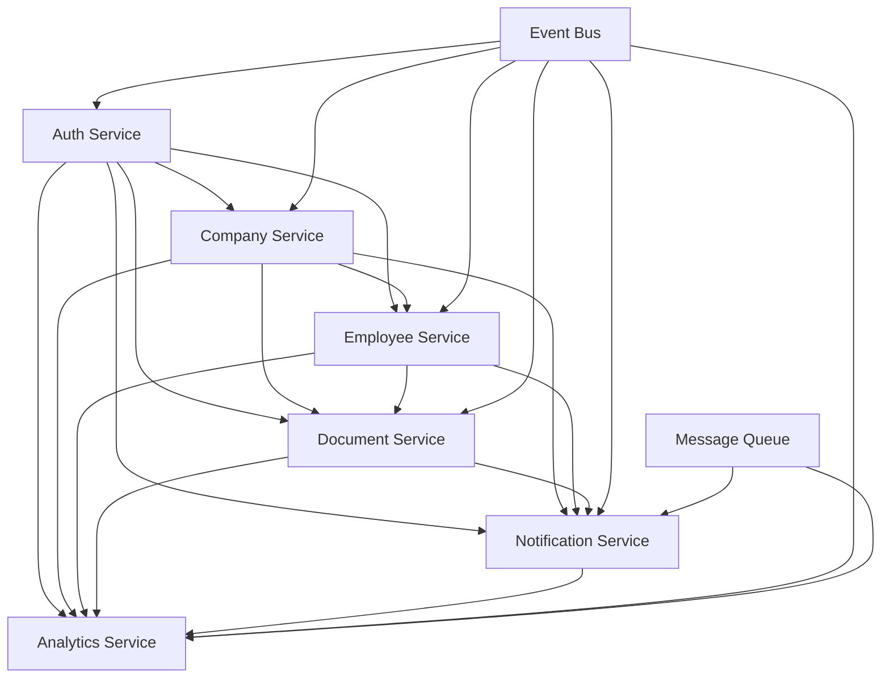

# تصميم بنية الخدمات المصغرة - HRMS Elite

## نظرة عامة

تم تصميم بنية الخدمات المصغرة لتقسيم النظام إلى خدمات مستقلة وقابلة للتوسع، كل خدمة مسؤولة عن مجال عمل محدد مع واجهات واضحة للتفاعل مع الخدمات الأخرى.

## 1. Auth Service (خدمة المصادقة)

### 1.1 حدود الخدمة
- **النطاق**: إدارة المصادقة والصلاحيات والجلسات
- **الاستقلالية**: قاعدة بيانات خاصة للمستخدمين والجلسات
- **التواصل**: REST API + Event Bus

### 1.2 المسؤوليات الأساسية
```typescript
interface AuthService {
  // إدارة المستخدمين
  createUser(userData: CreateUserRequest): Promise<User>
  updateUser(userId: string, updates: UpdateUserRequest): Promise<User>
  deleteUser(userId: string): Promise<void>
  getUserById(userId: string): Promise<User>
  searchUsers(query: UserSearchQuery): Promise<User[]>
  
  // إدارة الجلسات
  createSession(userId: string, companyId?: string): Promise<Session>
  validateSession(sessionId: string): Promise<SessionValidationResult>
  revokeSession(sessionId: string): Promise<void>
  refreshSession(sessionId: string): Promise<Session>
  
  // إدارة الصلاحيات
  assignRole(userId: string, companyId: string, role: UserRole): Promise<void>
  revokeRole(userId: string, companyId: string): Promise<void>
  getUserPermissions(userId: string, companyId: string): Promise<Permission[]>
  validatePermission(userId: string, permission: string): Promise<boolean>
  
  // إدارة الشركات للمستخدم
  addUserToCompany(userId: string, companyId: string, role: UserRole): Promise<void>
  removeUserFromCompany(userId: string, companyId: string): Promise<void>
  getUserCompanies(userId: string): Promise<Company[]>
}
```

### 1.3 قاعدة البيانات
```sql
-- جدول المستخدمين
CREATE TABLE users (
  id TEXT PRIMARY KEY,
  email TEXT UNIQUE NOT NULL,
  password_hash TEXT NOT NULL,
  first_name TEXT NOT NULL,
  last_name TEXT NOT NULL,
  profile_image_url TEXT,
  is_active BOOLEAN DEFAULT true,
  email_verified BOOLEAN DEFAULT false,
  created_at TIMESTAMP DEFAULT CURRENT_TIMESTAMP,
  updated_at TIMESTAMP DEFAULT CURRENT_TIMESTAMP
);

-- جدول الجلسات
CREATE TABLE sessions (
  id TEXT PRIMARY KEY,
  user_id TEXT NOT NULL,
  company_id TEXT,
  token_hash TEXT NOT NULL,
  expires_at TIMESTAMP NOT NULL,
  created_at TIMESTAMP DEFAULT CURRENT_TIMESTAMP,
  FOREIGN KEY (user_id) REFERENCES users(id) ON DELETE CASCADE
);

-- جدول صلاحيات المستخدمين في الشركات
CREATE TABLE user_company_roles (
  user_id TEXT NOT NULL,
  company_id TEXT NOT NULL,
  role TEXT NOT NULL,
  permissions JSON DEFAULT '[]',
  created_at TIMESTAMP DEFAULT CURRENT_TIMESTAMP,
  PRIMARY KEY (user_id, company_id)
);
```

### 1.4 الأحداث المنشورة
```typescript
// أحداث المصادقة
interface AuthEvents {
  'user.created': { userId: string; userData: User }
  'user.updated': { userId: string; updates: Partial<User> }
  'user.deleted': { userId: string }
  'session.created': { sessionId: string; userId: string; companyId?: string }
  'session.revoked': { sessionId: string; userId: string }
  'role.assigned': { userId: string; companyId: string; role: UserRole }
  'role.revoked': { userId: string; companyId: string }
}
```

## 2. Company Service (خدمة الشركات)

### 2.1 حدود الخدمة
- **النطاق**: إدارة بيانات الشركات والتراخيص والإحصائيات
- **الاستقلالية**: قاعدة بيانات خاصة للشركات والتراخيص
- **التواصل**: REST API + Event Bus

### 2.2 المسؤوليات الأساسية
```typescript
interface CompanyService {
  // إدارة الشركات
  createCompany(companyData: CreateCompanyRequest): Promise<Company>
  updateCompany(companyId: string, updates: UpdateCompanyRequest): Promise<Company>
  deleteCompany(companyId: string): Promise<void>
  getCompanyById(companyId: string): Promise<Company>
  searchCompanies(query: CompanySearchQuery): Promise<Company[]>
  
  // إدارة التراخيص
  createLicense(companyId: string, licenseData: CreateLicenseRequest): Promise<License>
  updateLicense(licenseId: string, updates: UpdateLicenseRequest): Promise<License>
  deleteLicense(licenseId: string): Promise<void>
  getCompanyLicenses(companyId: string): Promise<License[]>
  getExpiringLicenses(daysThreshold: number): Promise<License[]>
  
  // الإحصائيات والتقارير
  getCompanyStats(companyId: string): Promise<CompanyStats>
  getIndustryStats(industryType: string): Promise<IndustryStats>
  getLocationStats(location: string): Promise<LocationStats>
  
  // البحث والتصفية
  searchCompaniesByIndustry(industryType: string): Promise<Company[]>
  searchCompaniesByLocation(location: string): Promise<Company[]>
  getCompaniesByEmployeeRange(minEmployees: number, maxEmployees: number): Promise<Company[]>
}
```

### 2.3 قاعدة البيانات
```sql
-- جدول الشركات
CREATE TABLE companies (
  id TEXT PRIMARY KEY,
  name TEXT NOT NULL,
  commercial_file_number TEXT UNIQUE,
  commercial_file_name TEXT,
  establishment_date DATE,
  classification TEXT,
  department TEXT,
  legal_entity TEXT,
  ownership_category TEXT,
  logo_url TEXT,
  address TEXT,
  phone TEXT,
  email TEXT,
  website TEXT,
  industry_type TEXT,
  business_activity TEXT,
  location TEXT,
  tax_number TEXT,
  is_active BOOLEAN DEFAULT true,
  created_at TIMESTAMP DEFAULT CURRENT_TIMESTAMP,
  updated_at TIMESTAMP DEFAULT CURRENT_TIMESTAMP
);

-- جدول التراخيص
CREATE TABLE licenses (
  id TEXT PRIMARY KEY,
  company_id TEXT NOT NULL,
  name TEXT NOT NULL,
  type TEXT NOT NULL,
  number TEXT NOT NULL,
  status TEXT DEFAULT 'active',
  issue_date DATE,
  expiry_date DATE,
  issuing_authority TEXT,
  location TEXT,
  description TEXT,
  documents JSON DEFAULT '[]',
  is_active BOOLEAN DEFAULT true,
  created_at TIMESTAMP DEFAULT CURRENT_TIMESTAMP,
  updated_at TIMESTAMP DEFAULT CURRENT_TIMESTAMP,
  FOREIGN KEY (company_id) REFERENCES companies(id) ON DELETE CASCADE
);

-- جدول إحصائيات الشركات
CREATE TABLE company_stats (
  company_id TEXT PRIMARY KEY,
  total_employees INTEGER DEFAULT 0,
  total_licenses INTEGER DEFAULT 0,
  total_salary DECIMAL(15,2) DEFAULT 0,
  last_updated TIMESTAMP DEFAULT CURRENT_TIMESTAMP,
  FOREIGN KEY (company_id) REFERENCES companies(id) ON DELETE CASCADE
);
```

### 2.4 الأحداث المنشورة
```typescript
// أحداث الشركات
interface CompanyEvents {
  'company.created': { companyId: string; companyData: Company }
  'company.updated': { companyId: string; updates: Partial<Company> }
  'company.deleted': { companyId: string }
  'license.created': { licenseId: string; companyId: string; licenseData: License }
  'license.updated': { licenseId: string; updates: Partial<License> }
  'license.expiring': { licenseId: string; companyId: string; daysUntilExpiry: number }
  'license.expired': { licenseId: string; companyId: string }
}
```

## 3. Employee Service (خدمة الموظفين)

### 3.1 حدود الخدمة
- **النطاق**: إدارة بيانات الموظفين والإجازات والخصومات
- **الاستقلالية**: قاعدة بيانات خاصة للموظفين والإجازات
- **التواصل**: REST API + Event Bus

### 3.2 المسؤوليات الأساسية
```typescript
interface EmployeeService {
  // إدارة الموظفين
  createEmployee(companyId: string, employeeData: CreateEmployeeRequest): Promise<Employee>
  updateEmployee(employeeId: string, updates: UpdateEmployeeRequest): Promise<Employee>
  deleteEmployee(employeeId: string): Promise<void>
  getEmployeeById(employeeId: string): Promise<Employee>
  getCompanyEmployees(companyId: string): Promise<Employee[]>
  searchEmployees(query: EmployeeSearchQuery): Promise<Employee[]>
  
  // إدارة الإجازات
  createLeaveRequest(employeeId: string, leaveData: CreateLeaveRequest): Promise<Leave>
  updateLeaveRequest(leaveId: string, updates: UpdateLeaveRequest): Promise<Leave>
  approveLeaveRequest(leaveId: string, approverId: string): Promise<Leave>
  rejectLeaveRequest(leaveId: string, approverId: string, reason: string): Promise<Leave>
  getEmployeeLeaves(employeeId: string): Promise<Leave[]>
  getCompanyLeaves(companyId: string): Promise<Leave[]>
  
  // إدارة الخصومات
  createDeduction(employeeId: string, deductionData: CreateDeductionRequest): Promise<Deduction>
  updateDeduction(deductionId: string, updates: UpdateDeductionRequest): Promise<Deduction>
  deleteDeduction(deductionId: string): Promise<void>
  getEmployeeDeductions(employeeId: string): Promise<Deduction[]>
  getCompanyDeductions(companyId: string): Promise<Deduction[]>
  
  // التقارير والإحصائيات
  getEmployeeStats(employeeId: string): Promise<EmployeeStats>
  getCompanyEmployeeStats(companyId: string): Promise<CompanyEmployeeStats>
  getLeaveStats(companyId: string, period: DateRange): Promise<LeaveStats>
  getDeductionStats(companyId: string, period: DateRange): Promise<DeductionStats>
}
```

### 3.3 قاعدة البيانات
```sql
-- جدول الموظفين
CREATE TABLE employees (
  id TEXT PRIMARY KEY,
  company_id TEXT NOT NULL,
  license_id TEXT,
  first_name TEXT NOT NULL,
  last_name TEXT NOT NULL,
  arabic_name TEXT,
  english_name TEXT,
  passport_number TEXT,
  civil_id TEXT,
  nationality TEXT,
  date_of_birth DATE,
  gender TEXT,
  marital_status TEXT,
  employee_type TEXT DEFAULT 'citizen',
  status TEXT DEFAULT 'active',
  position TEXT,
  department TEXT,
  hire_date DATE,
  salary DECIMAL(10,2),
  phone TEXT,
  email TEXT,
  address TEXT,
  emergency_contact TEXT,
  emergency_phone TEXT,
  photo_url TEXT,
  documents JSON DEFAULT '[]',
  skills JSON DEFAULT '[]',
  notes TEXT,
  is_archived BOOLEAN DEFAULT false,
  created_at TIMESTAMP DEFAULT CURRENT_TIMESTAMP,
  updated_at TIMESTAMP DEFAULT CURRENT_TIMESTAMP,
  FOREIGN KEY (company_id) REFERENCES companies(id) ON DELETE CASCADE,
  FOREIGN KEY (license_id) REFERENCES licenses(id) ON DELETE SET NULL
);

-- جدول الإجازات
CREATE TABLE employee_leaves (
  id TEXT PRIMARY KEY,
  employee_id TEXT NOT NULL,
  type TEXT NOT NULL,
  status TEXT DEFAULT 'pending',
  start_date DATE NOT NULL,
  end_date DATE NOT NULL,
  days INTEGER NOT NULL,
  reason TEXT,
  approved_by TEXT,
  approved_at TIMESTAMP,
  rejection_reason TEXT,
  created_at TIMESTAMP DEFAULT CURRENT_TIMESTAMP,
  updated_at TIMESTAMP DEFAULT CURRENT_TIMESTAMP,
  FOREIGN KEY (employee_id) REFERENCES employees(id) ON DELETE CASCADE
);

-- جدول الخصومات
CREATE TABLE employee_deductions (
  id TEXT PRIMARY KEY,
  employee_id TEXT NOT NULL,
  type TEXT NOT NULL,
  amount DECIMAL(10,2) NOT NULL,
  reason TEXT NOT NULL,
  date DATE NOT NULL,
  status TEXT DEFAULT 'active',
  processed_by TEXT NOT NULL,
  created_at TIMESTAMP DEFAULT CURRENT_TIMESTAMP,
  FOREIGN KEY (employee_id) REFERENCES employees(id) ON DELETE CASCADE
);
```

### 3.4 الأحداث المنشورة
```typescript
// أحداث الموظفين
interface EmployeeEvents {
  'employee.created': { employeeId: string; companyId: string; employeeData: Employee }
  'employee.updated': { employeeId: string; updates: Partial<Employee> }
  'employee.deleted': { employeeId: string; companyId: string }
  'employee.archived': { employeeId: string; companyId: string; reason: string }
  'leave.created': { leaveId: string; employeeId: string; leaveData: Leave }
  'leave.approved': { leaveId: string; employeeId: string; approverId: string }
  'leave.rejected': { leaveId: string; employeeId: string; approverId: string; reason: string }
  'deduction.created': { deductionId: string; employeeId: string; deductionData: Deduction }
  'deduction.updated': { deductionId: string; updates: Partial<Deduction> }
}
```

## 4. Document Service (خدمة المستندات)

### 4.1 حدود الخدمة
- **النطاق**: إدارة المستندات والملفات والنسخ الاحتياطية
- **الاستقلالية**: نظام ملفات خاص + قاعدة بيانات للميتاداتا
- **التواصل**: REST API + Event Bus

### 4.2 المسؤوليات الأساسية
```typescript
interface DocumentService {
  // إدارة الملفات
  uploadFile(file: File, metadata: FileMetadata): Promise<Document>
  downloadFile(documentId: string): Promise<File>
  deleteFile(documentId: string): Promise<void>
  getFileMetadata(documentId: string): Promise<Document>
  
  // إدارة المجلدات
  createFolder(folderData: CreateFolderRequest): Promise<Folder>
  deleteFolder(folderId: string): Promise<void>
  getFolderContents(folderId: string): Promise<FolderContents>
  
  // البحث في المستندات
  searchDocuments(query: DocumentSearchQuery): Promise<Document[]>
  searchByContent(searchTerm: string): Promise<Document[]>
  searchByType(documentType: string): Promise<Document[]>
  
  // إدارة النسخ الاحتياطية
  createBackup(backupData: CreateBackupRequest): Promise<Backup>
  restoreBackup(backupId: string): Promise<void>
  listBackups(): Promise<Backup[]>
  
  // التحقق من صحة الملفات
  validateFile(file: File): Promise<ValidationResult>
  scanForViruses(file: File): Promise<ScanResult>
  checkFileIntegrity(documentId: string): Promise<IntegrityResult>
}
```

### 4.3 قاعدة البيانات
```sql
-- جدول المستندات
CREATE TABLE documents (
  id TEXT PRIMARY KEY,
  name TEXT NOT NULL,
  original_name TEXT NOT NULL,
  file_path TEXT NOT NULL,
  file_size INTEGER NOT NULL,
  mime_type TEXT NOT NULL,
  document_type TEXT,
  uploaded_by TEXT NOT NULL,
  company_id TEXT,
  folder_id TEXT,
  tags JSON DEFAULT '[]',
  metadata JSON DEFAULT '{}',
  is_public BOOLEAN DEFAULT false,
  created_at TIMESTAMP DEFAULT CURRENT_TIMESTAMP,
  updated_at TIMESTAMP DEFAULT CURRENT_TIMESTAMP
);

-- جدول المجلدات
CREATE TABLE folders (
  id TEXT PRIMARY KEY,
  name TEXT NOT NULL,
  parent_folder_id TEXT,
  created_by TEXT NOT NULL,
  company_id TEXT,
  is_public BOOLEAN DEFAULT false,
  created_at TIMESTAMP DEFAULT CURRENT_TIMESTAMP,
  updated_at TIMESTAMP DEFAULT CURRENT_TIMESTAMP,
  FOREIGN KEY (parent_folder_id) REFERENCES folders(id) ON DELETE CASCADE
);

-- جدول النسخ الاحتياطية
CREATE TABLE backups (
  id TEXT PRIMARY KEY,
  name TEXT NOT NULL,
  description TEXT,
  backup_path TEXT NOT NULL,
  backup_size INTEGER NOT NULL,
  backup_type TEXT NOT NULL,
  status TEXT DEFAULT 'pending',
  created_by TEXT NOT NULL,
  created_at TIMESTAMP DEFAULT CURRENT_TIMESTAMP,
  completed_at TIMESTAMP
);
```

### 4.4 الأحداث المنشورة
```typescript
// أحداث المستندات
interface DocumentEvents {
  'document.uploaded': { documentId: string; metadata: Document }
  'document.deleted': { documentId: string; filePath: string }
  'document.downloaded': { documentId: string; userId: string }
  'folder.created': { folderId: string; folderData: Folder }
  'folder.deleted': { folderId: string }
  'backup.created': { backupId: string; backupData: Backup }
  'backup.completed': { backupId: string }
  'backup.restored': { backupId: string }
}
```

## 5. Notification Service (خدمة الإشعارات)

### 5.1 حدود الخدمة
- **النطاق**: إدارة الإشعارات والتنبيهات والتواصل
- **الاستقلالية**: قاعدة بيانات خاصة للإشعارات
- **التواصل**: REST API + Event Bus + WebSocket

### 5.2 المسؤوليات الأساسية
```typescript
interface NotificationService {
  // إدارة الإشعارات
  createNotification(notificationData: CreateNotificationRequest): Promise<Notification>
  sendNotification(notificationId: string): Promise<void>
  markAsRead(notificationId: string, userId: string): Promise<void>
  markAllAsRead(userId: string): Promise<void>
  deleteNotification(notificationId: string): Promise<void>
  
  // إدارة التفضيلات
  getUserPreferences(userId: string): Promise<NotificationPreferences>
  updateUserPreferences(userId: string, preferences: UpdatePreferencesRequest): Promise<void>
  subscribeToChannel(userId: string, channel: string): Promise<void>
  unsubscribeFromChannel(userId: string, channel: string): Promise<void>
  
  // إدارة القنوات
  createChannel(channelData: CreateChannelRequest): Promise<Channel>
  deleteChannel(channelId: string): Promise<void>
  broadcastToChannel(channelId: string, message: BroadcastMessage): Promise<void>
  
  // تتبع الإشعارات
  getNotificationHistory(userId: string): Promise<Notification[]>
  getNotificationStats(userId: string): Promise<NotificationStats>
  getDeliveryStatus(notificationId: string): Promise<DeliveryStatus>
  
  // إعدادات التنبيهات
  createAlertRule(ruleData: CreateAlertRuleRequest): Promise<AlertRule>
  updateAlertRule(ruleId: string, updates: UpdateAlertRuleRequest): Promise<AlertRule>
  deleteAlertRule(ruleId: string): Promise<void>
  triggerAlert(ruleId: string, data: AlertData): Promise<void>
}
```

### 5.3 قاعدة البيانات
```sql
-- جدول الإشعارات
CREATE TABLE notifications (
  id TEXT PRIMARY KEY,
  title TEXT NOT NULL,
  message TEXT NOT NULL,
  type TEXT NOT NULL,
  priority TEXT DEFAULT 'normal',
  sender_id TEXT,
  recipient_id TEXT NOT NULL,
  channel_id TEXT,
  data JSON DEFAULT '{}',
  is_read BOOLEAN DEFAULT false,
  read_at TIMESTAMP,
  sent_at TIMESTAMP DEFAULT CURRENT_TIMESTAMP,
  delivered_at TIMESTAMP,
  created_at TIMESTAMP DEFAULT CURRENT_TIMESTAMP
);

-- جدول تفضيلات الإشعارات
CREATE TABLE notification_preferences (
  user_id TEXT PRIMARY KEY,
  email_enabled BOOLEAN DEFAULT true,
  push_enabled BOOLEAN DEFAULT true,
  sms_enabled BOOLEAN DEFAULT false,
  quiet_hours_start TIME,
  quiet_hours_end TIME,
  timezone TEXT DEFAULT 'UTC',
  preferences JSON DEFAULT '{}',
  created_at TIMESTAMP DEFAULT CURRENT_TIMESTAMP,
  updated_at TIMESTAMP DEFAULT CURRENT_TIMESTAMP
);

-- جدول القنوات
CREATE TABLE notification_channels (
  id TEXT PRIMARY KEY,
  name TEXT NOT NULL,
  description TEXT,
  type TEXT NOT NULL,
  is_active BOOLEAN DEFAULT true,
  created_at TIMESTAMP DEFAULT CURRENT_TIMESTAMP
);

-- جدول اشتراكات القنوات
CREATE TABLE channel_subscriptions (
  user_id TEXT NOT NULL,
  channel_id TEXT NOT NULL,
  subscribed_at TIMESTAMP DEFAULT CURRENT_TIMESTAMP,
  PRIMARY KEY (user_id, channel_id),
  FOREIGN KEY (channel_id) REFERENCES notification_channels(id) ON DELETE CASCADE
);

-- جدول قواعد التنبيهات
CREATE TABLE alert_rules (
  id TEXT PRIMARY KEY,
  name TEXT NOT NULL,
  description TEXT,
  event_type TEXT NOT NULL,
  conditions JSON NOT NULL,
  actions JSON NOT NULL,
  is_active BOOLEAN DEFAULT true,
  created_by TEXT NOT NULL,
  created_at TIMESTAMP DEFAULT CURRENT_TIMESTAMP,
  updated_at TIMESTAMP DEFAULT CURRENT_TIMESTAMP
);
```

### 5.4 الأحداث المنشورة
```typescript
// أحداث الإشعارات
interface NotificationEvents {
  'notification.created': { notificationId: string; notificationData: Notification }
  'notification.sent': { notificationId: string; recipientId: string }
  'notification.delivered': { notificationId: string; recipientId: string }
  'notification.read': { notificationId: string; userId: string }
  'channel.created': { channelId: string; channelData: Channel }
  'channel.broadcast': { channelId: string; message: BroadcastMessage }
  'alert.triggered': { ruleId: string; alertData: AlertData }
  'preferences.updated': { userId: string; preferences: NotificationPreferences }
}
```

## 6. Analytics Service (خدمة التحليلات)

### 6.1 حدود الخدمة
- **النطاق**: التحليلات والتقارير والإحصائيات
- **الاستقلالية**: قاعدة بيانات خاصة للتحليلات
- **التواصل**: REST API + Event Bus

### 6.2 المسؤوليات الأساسية
```typescript
interface AnalyticsService {
  // جمع البيانات
  trackEvent(eventData: TrackEventRequest): Promise<void>
  trackPageView(pageViewData: TrackPageViewRequest): Promise<void>
  trackUserAction(actionData: TrackUserActionRequest): Promise<void>
  
  // التحليلات الأساسية
  getUserAnalytics(userId: string, period: DateRange): Promise<UserAnalytics>
  getCompanyAnalytics(companyId: string, period: DateRange): Promise<CompanyAnalytics>
  getSystemAnalytics(period: DateRange): Promise<SystemAnalytics>
  
  // التقارير
  generateReport(reportConfig: ReportConfig): Promise<Report>
  scheduleReport(scheduleConfig: ScheduleConfig): Promise<ScheduledReport>
  getReportHistory(): Promise<Report[]>
  
  // لوحات المعلومات
  getDashboard(dashboardId: string): Promise<Dashboard>
  createDashboard(dashboardData: CreateDashboardRequest): Promise<Dashboard>
  updateDashboard(dashboardId: string, updates: UpdateDashboardRequest): Promise<Dashboard>
  deleteDashboard(dashboardId: string): Promise<void>
  
  // التنبؤات والتحليلات المتقدمة
  predictTrends(dataType: string, period: DateRange): Promise<TrendPrediction>
  detectAnomalies(dataType: string): Promise<AnomalyDetection>
  generateInsights(dataType: string): Promise<Insight[]>
  
  // تصدير البيانات
  exportData(exportConfig: ExportConfig): Promise<ExportResult>
  getExportHistory(): Promise<Export[]>
}
```

### 6.3 قاعدة البيانات
```sql
-- جدول الأحداث
CREATE TABLE analytics_events (
  id TEXT PRIMARY KEY,
  event_type TEXT NOT NULL,
  user_id TEXT,
  company_id TEXT,
  session_id TEXT,
  page_url TEXT,
  action_name TEXT,
  action_data JSON DEFAULT '{}',
  user_agent TEXT,
  ip_address TEXT,
  timestamp TIMESTAMP DEFAULT CURRENT_TIMESTAMP
);

-- جدول إحصائيات الصفحات
CREATE TABLE page_views (
  id TEXT PRIMARY KEY,
  page_url TEXT NOT NULL,
  user_id TEXT,
  company_id TEXT,
  session_id TEXT,
  time_spent INTEGER,
  timestamp TIMESTAMP DEFAULT CURRENT_TIMESTAMP
);

-- جدول إحصائيات المستخدمين
CREATE TABLE user_analytics (
  user_id TEXT PRIMARY KEY,
  total_sessions INTEGER DEFAULT 0,
  total_page_views INTEGER DEFAULT 0,
  last_activity TIMESTAMP,
  created_at TIMESTAMP DEFAULT CURRENT_TIMESTAMP,
  updated_at TIMESTAMP DEFAULT CURRENT_TIMESTAMP
);

-- جدول إحصائيات الشركات
CREATE TABLE company_analytics (
  company_id TEXT PRIMARY KEY,
  total_users INTEGER DEFAULT 0,
  total_employees INTEGER DEFAULT 0,
  total_licenses INTEGER DEFAULT 0,
  active_users INTEGER DEFAULT 0,
  last_updated TIMESTAMP DEFAULT CURRENT_TIMESTAMP
);

-- جدول التقارير
CREATE TABLE reports (
  id TEXT PRIMARY KEY,
  name TEXT NOT NULL,
  description TEXT,
  report_type TEXT NOT NULL,
  config JSON NOT NULL,
  status TEXT DEFAULT 'pending',
  result_url TEXT,
  created_by TEXT NOT NULL,
  created_at TIMESTAMP DEFAULT CURRENT_TIMESTAMP,
  completed_at TIMESTAMP
);

-- جدول لوحات المعلومات
CREATE TABLE dashboards (
  id TEXT PRIMARY KEY,
  name TEXT NOT NULL,
  description TEXT,
  layout JSON NOT NULL,
  widgets JSON NOT NULL,
  is_public BOOLEAN DEFAULT false,
  created_by TEXT NOT NULL,
  created_at TIMESTAMP DEFAULT CURRENT_TIMESTAMP,
  updated_at TIMESTAMP DEFAULT CURRENT_TIMESTAMP
);
```

### 6.4 الأحداث المنشورة
```typescript
// أحداث التحليلات
interface AnalyticsEvents {
  'event.tracked': { eventId: string; eventData: AnalyticsEvent }
  'page.viewed': { pageViewId: string; pageViewData: PageView }
  'user.action': { actionId: string; actionData: UserAction }
  'report.generated': { reportId: string; reportData: Report }
  'dashboard.created': { dashboardId: string; dashboardData: Dashboard }
  'dashboard.updated': { dashboardId: string; updates: Partial<Dashboard> }
  'insight.generated': { insightId: string; insightData: Insight }
  'anomaly.detected': { anomalyId: string; anomalyData: Anomaly }
}
```

## 7. تفاعل الخدمات

### 7.1 أنماط الاتصال

#### 7.1.1 REST APIs
```typescript
// مثال: Auth Service يتواصل مع Company Service
interface AuthServiceAPI {
  // التحقق من وجود الشركة
  GET /api/companies/{companyId}/exists: Promise<{ exists: boolean }>
  
  // الحصول على معلومات الشركة الأساسية
  GET /api/companies/{companyId}/basic: Promise<CompanyBasicInfo>
}

// مثال: Employee Service يتواصل مع Company Service
interface EmployeeServiceAPI {
  // التحقق من وجود الشركة
  GET /api/companies/{companyId}/exists: Promise<{ exists: boolean }>
  
  // الحصول على معلومات الشركة
  GET /api/companies/{companyId}: Promise<Company>
}
```

#### 7.1.2 Event Bus
```typescript
// مثال: عند إنشاء شركة جديدة
interface CompanyCreatedEvent {
  event: 'company.created'
  data: {
    companyId: string
    companyData: Company
    timestamp: string
  }
}

// الخدمات التي تستمع لهذا الحدث
interface EventHandlers {
  'company.created': {
    'auth-service': 'createDefaultRoles'
    'notification-service': 'notifyAdmins'
    'analytics-service': 'trackCompanyCreation'
  }
}
```

#### 7.1.3 Message Queue
```typescript
// مثال: إرسال إشعارات غير متزامنة
interface NotificationQueue {
  queue: 'notifications'
  message: {
    type: 'email' | 'push' | 'sms'
    recipient: string
    template: string
    data: Record<string, any>
  }
}
```

### 7.2 مخطط التفاعل



### 7.3 أمثلة على التفاعل

#### 7.3.1 إنشاء شركة جديدة
```typescript
// 1. Company Service ينشئ الشركة
const company = await companyService.createCompany(companyData);

// 2. Company Service ينشر الحدث
eventBus.publish('company.created', {
  companyId: company.id,
  companyData: company,
  timestamp: new Date().toISOString()
});

// 3. Auth Service يستمع للحدث وينشئ الأدوار الافتراضية
eventBus.subscribe('company.created', async (event) => {
  await authService.createDefaultRoles(event.companyId);
});

// 4. Notification Service يستمع للحدث ويرسل إشعارات
eventBus.subscribe('company.created', async (event) => {
  await notificationService.notifyAdmins('New company registered', event.companyData);
});

// 5. Analytics Service يستمع للحدث ويتتبع الإحصائيات
eventBus.subscribe('company.created', async (event) => {
  await analyticsService.trackEvent({
    eventType: 'company.created',
    companyId: event.companyId,
    data: event.companyData
  });
});
```

#### 7.3.2 تسجيل دخول المستخدم
```typescript
// 1. Auth Service يتحقق من بيانات الدخول
const session = await authService.createSession(userId, companyId);

// 2. Auth Service ينشر الحدث
eventBus.publish('user.logged_in', {
  userId: userId,
  companyId: companyId,
  sessionId: session.id,
  timestamp: new Date().toISOString()
});

// 3. Analytics Service يتتبع تسجيل الدخول
eventBus.subscribe('user.logged_in', async (event) => {
  await analyticsService.trackEvent({
    eventType: 'user.login',
    userId: event.userId,
    companyId: event.companyId,
    sessionId: event.sessionId
  });
});

// 4. Notification Service يرسل إشعار ترحيب
eventBus.subscribe('user.logged_in', async (event) => {
  await notificationService.sendWelcomeNotification(event.userId);
});
```

## 8. استراتيجية النشر

### 8.1 التطوير التدريجي
```typescript
// المرحلة 1: تطوير الخدمات الأساسية
const phase1Services = [
  'auth-service',
  'company-service',
  'employee-service'
];

// المرحلة 2: إضافة الخدمات المتقدمة
const phase2Services = [
  'document-service',
  'notification-service'
];

// المرحلة 3: إضافة التحليلات
const phase3Services = [
  'analytics-service'
];
```

### 8.2 تكوين Docker
```dockerfile
# مثال: تكوين Auth Service
FROM node:18-alpine
WORKDIR /app
COPY package*.json ./
RUN npm ci --only=production
COPY dist ./dist
EXPOSE 3001
CMD ["node", "dist/index.js"]
```

### 8.3 تكوين Kubernetes
```yaml
# مثال: تكوين Auth Service
apiVersion: apps/v1
kind: Deployment
metadata:
  name: auth-service
spec:
  replicas: 3
  selector:
    matchLabels:
      app: auth-service
  template:
    metadata:
      labels:
        app: auth-service
    spec:
      containers:
      - name: auth-service
        image: hrmse/auth-service:latest
        ports:
        - containerPort: 3001
        env:
        - name: DATABASE_URL
          valueFrom:
            secretKeyRef:
              name: auth-db-secret
              key: url
        - name: JWT_SECRET
          valueFrom:
            secretKeyRef:
              name: auth-secrets
              key: jwt-secret
```

## 9. المراقبة والمراقبة

### 9.1 Health Checks
```typescript
// مثال: Health Check للخدمة
interface HealthCheck {
  service: string
  status: 'healthy' | 'unhealthy' | 'degraded'
  timestamp: string
  checks: {
    database: boolean
    externalServices: boolean
    diskSpace: boolean
    memory: boolean
  }
  metrics: {
    responseTime: number
    errorRate: number
    throughput: number
  }
}
```

### 9.2 Logging
```typescript
// مثال: Structured Logging
interface ServiceLog {
  timestamp: string
  level: 'debug' | 'info' | 'warn' | 'error'
  service: string
  traceId: string
  userId?: string
  companyId?: string
  message: string
  metadata: Record<string, any>
}
```

### 9.3 Metrics
```typescript
// مثال: Metrics Collection
interface ServiceMetrics {
  service: string
  timestamp: string
  requests: {
    total: number
    successful: number
    failed: number
    averageResponseTime: number
  }
  resources: {
    cpuUsage: number
    memoryUsage: number
    diskUsage: number
  }
  business: {
    activeUsers: number
    transactions: number
    revenue: number
  }
}
```

## 10. الخلاصة

تم تصميم بنية الخدمات المصغرة لتوفير:

1. **الاستقلالية**: كل خدمة مستقلة بذاتها مع قاعدة بيانات خاصة
2. **قابلية التوسع**: إمكانية توسيع كل خدمة بشكل مستقل
3. **المرونة**: سهولة إضافة ميزات جديدة أو تعديل الخدمات الموجودة
4. **الموثوقية**: عزل الأعطال بين الخدمات
5. **الأداء**: تحسين الأداء من خلال التخصص
6. **الصيانة**: سهولة صيانة وتحديث الخدمات

هذا التصميم يوفر أساساً قوياً لنظام HRMS Elite قابل للتوسع والنمو المستقبلي.
